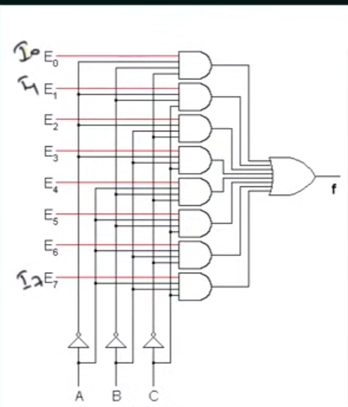
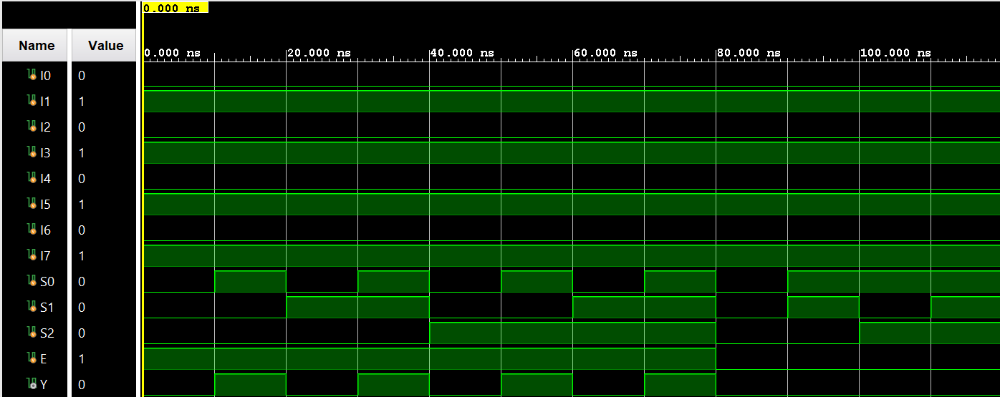

## 8:1 Multiplexer \| Verilog

A Verilog implementation of an **8:1 multiplexer with enable**, developed and simulated in the Vivado IDE. This document explains what a multiplexer is, how an **8:1 MUX** behaves, derives the **Boolean equation**, summarizes the **circuit, waveform, and testbench results**, and provides steps to run the project in Vivado.

---

## Table of Contents

- [What Is an 8:1 Multiplexer?](#what-is-an-81-multiplexer)
- [8:1 MUX Truth Table and Behavior](#81-mux-truth-table-and-behavior)
- [Boolean Equation and Logic Simplification](#boolean-equation-and-logic-simplification)
- [8:1 Multiplexer Architecture](#81-multiplexer-architecture)
- [Learning Resources](#learning-resources)
- [Circuit Diagram](#circuit-diagram)
- [Waveform Diagram](#waveform-diagram)
- [Testbench Output](#testbench-output)
- [Running the Project in Vivado](#running-the-project-in-vivado)
- [Project Files](#project-files)

---

## What Is an 8:1 Multiplexer?

A **multiplexer (MUX)** is a combinational circuit that selects **one of several input signals** and forwards it to a **single output line**, based on the value of **selector inputs**.

In general:

- **n** = number of data inputs  
- **m** = number of select lines  
- They are related by: \( n = 2^m \)

Examples:

- A 2:1 MUX has 2 inputs, 1 select line.
- A 4:1 MUX has 4 inputs, 2 select lines.
- An **8:1 MUX** has 8 inputs, 3 select lines.

This project focuses on an **8:1 multiplexer with an enable input**:

- **Inputs**
  - **I<sub>0</sub>**, **I<sub>1</sub>**, **I<sub>2</sub>**, **I<sub>3</sub>**, **I<sub>4</sub>**, **I<sub>5</sub>**, **I<sub>6</sub>**, **I<sub>7</sub>** — data inputs  
  - **S<sub>2</sub>**, **S<sub>1</sub>**, **S<sub>0</sub>** — select lines (3 bits total)  
  - **E** — enable input (1 bit)
- **Output**
  - **Y** — selected data output

**Intuitive behavior:**

- When **E = 0**, the MUX is **disabled** and the output is forced to 0.
- When **E = 1**, the MUX is **enabled** and the output **Y** equals one of the eight inputs according to the select lines:
  - S<sub>2</sub> S<sub>1</sub> S<sub>0</sub> = 000 → Y = I<sub>0</sub>  
  - S<sub>2</sub> S<sub>1</sub> S<sub>0</sub> = 001 → Y = I<sub>1</sub>  
  - S<sub>2</sub> S<sub>1</sub> S<sub>0</sub> = 010 → Y = I<sub>2</sub>  
  - S<sub>2</sub> S<sub>1</sub> S<sub>0</sub> = 011 → Y = I<sub>3</sub>  
  - S<sub>2</sub> S<sub>1</sub> S<sub>0</sub> = 100 → Y = I<sub>4</sub>  
  - S<sub>2</sub> S<sub>1</sub> S<sub>0</sub> = 101 → Y = I<sub>5</sub>  
  - S<sub>2</sub> S<sub>1</sub> S<sub>0</sub> = 110 → Y = I<sub>6</sub>  
  - S<sub>2</sub> S<sub>1</sub> S<sub>0</sub> = 111 → Y = I<sub>7</sub>  

**Advantages of multiplexers:**

- **Reduces wiring** and interconnect complexity.
- **Reduces circuit cost** and area.
- Commonly used in:
  - Data routing and bus selection.
  - Implementing logic functions.
  - Control path design in processors and digital systems.

---

## 8:1 MUX Truth Table and Behavior

The core behavior of an 8:1 MUX with enable can be summarized as:

- **Selector variables:** S<sub>2</sub>, S<sub>1</sub>, S<sub>0</sub> (3 bits)
- **Enable:** E
- **Inputs:** I<sub>0</sub> … I<sub>7</sub>
- **Output:** Y

- Ignoring the enable for a moment (E = 1), the **selection behavior** is:

| S<sub>2</sub> | S<sub>1</sub> | S<sub>0</sub> | Y              |
|---------------|---------------|---------------|----------------|
| 0             | 0             | 0             | I<sub>0</sub>  |
| 0             | 0             | 1             | I<sub>1</sub>  |
| 0             | 1             | 0             | I<sub>2</sub>  |
| 0             | 1             | 1             | I<sub>3</sub>  |
| 1             | 0             | 0             | I<sub>4</sub>  |
| 1             | 0             | 1             | I<sub>5</sub>  |
| 1             | 1             | 0             | I<sub>6</sub>  |
| 1             | 1             | 1             | I<sub>7</sub>  |

Including the enable input:

- When **E = 0**, **Y = 0** regardless of S<sub>2</sub>, S<sub>1</sub>, S<sub>0</sub>, or any **I<sub>k</sub>**.
- When **E = 1**, **Y** follows the selection table above.

This is the behavior confirmed by the waveform and testbench simulation.

---

## Boolean Equation and Logic Simplification

From the truth table, for **E = 1**, the **Boolean expression** for **Y** in terms of **S<sub>2</sub>**, **S<sub>1</sub>**, **S<sub>0</sub>**, and **I<sub>0</sub> … I<sub>7</sub>** is:

**Y = S<sub>2</sub>′ S<sub>1</sub>′ S<sub>0</sub>′ I<sub>0</sub>  
  + S<sub>2</sub>′ S<sub>1</sub>′ S<sub>0</sub> I<sub>1</sub>  
  + S<sub>2</sub>′ S<sub>1</sub> S<sub>0</sub>′ I<sub>2</sub>  
  + S<sub>2</sub>′ S<sub>1</sub> S<sub>0</sub> I<sub>3</sub>  
  + S<sub>2</sub> S<sub>1</sub>′ S<sub>0</sub>′ I<sub>4</sub>  
  + S<sub>2</sub> S<sub>1</sub>′ S<sub>0</sub> I<sub>5</sub>  
  + S<sub>2</sub> S<sub>1</sub> S<sub>0</sub>′ I<sub>6</sub>  
  + S<sub>2</sub> S<sub>1</sub> S<sub>0</sub> I<sub>7</sub>**

Incorporating the enable input **E**:

**Y = E ( S<sub>2</sub>′ S<sub>1</sub>′ S<sub>0</sub>′ I<sub>0</sub>  
  + S<sub>2</sub>′ S<sub>1</sub>′ S<sub>0</sub> I<sub>1</sub>  
  + S<sub>2</sub>′ S<sub>1</sub> S<sub>0</sub>′ I<sub>2</sub>  
  + S<sub>2</sub>′ S<sub>1</sub> S<sub>0</sub> I<sub>3</sub>  
  + S<sub>2</sub> S<sub>1</sub>′ S<sub>0</sub>′ I<sub>4</sub>  
  + S<sub>2</sub> S<sub>1</sub>′ S<sub>0</sub> I<sub>5</sub>  
  + S<sub>2</sub> S<sub>1</sub> S<sub>0</sub>′ I<sub>6</sub>  
  + S<sub>2</sub> S<sub>1</sub> S<sub>0</sub> I<sub>7</sub> )**

Where:

- **Adjacency (e.g., S<sub>2</sub>S<sub>1</sub>)** denotes **AND**.
- **“+”** denotes **OR**.
- The prime symbol **(′)** denotes the logical complement (NOT), e.g. **S<sub>2</sub>′** is the complement of S<sub>2</sub>.

Each product term corresponds to one row of the truth table and becomes active for a unique combination of S<sub>2</sub>, S<sub>1</sub>, and S<sub>0</sub>. The factor **E** ensures that the output propagates only when the MUX is enabled.

---

## 8:1 Multiplexer Architecture

The **8:1 MUX with enable** is a standard building block in digital circuits, often used to select one of eight data sources based on a 3-bit control word.

### Conceptual Block Diagram

- **Inputs**
  - I<sub>0</sub>, I<sub>1</sub>, I<sub>2</sub>, I<sub>3</sub>, I<sub>4</sub>, I<sub>5</sub>, I<sub>6</sub>, I<sub>7</sub> — data inputs
  - S<sub>2</sub>, S<sub>1</sub>, S<sub>0</sub> — select inputs
  - E — enable
- **Output**
  - Y — single data output

The internal circuit corresponds directly to the Boolean equation:

**Y = E ( S<sub>2</sub>′ S<sub>1</sub>′ S<sub>0</sub>′ I<sub>0</sub> + S<sub>2</sub>′ S<sub>1</sub>′ S<sub>0</sub> I<sub>1</sub> + S<sub>2</sub>′ S<sub>1</sub> S<sub>0</sub>′ I<sub>2</sub> + S<sub>2</sub>′ S<sub>1</sub> S<sub>0</sub> I<sub>3</sub> + S<sub>2</sub> S<sub>1</sub>′ S<sub>0</sub>′ I<sub>4</sub> + S<sub>2</sub> S<sub>1</sub>′ S<sub>0</sub> I<sub>5</sub> + S<sub>2</sub> S<sub>1</sub> S<sub>0</sub>′ I<sub>6</sub> + S<sub>2</sub> S<sub>1</sub> S<sub>0</sub> I<sub>7</sub> )**

### Implementation Notes

- The Verilog module is written as a **pure combinational circuit**.
- Typical coding styles:
  - A **`case` statement** on `{S2, S1, S0}` inside an `always @(*)` block, gated by **E**, or
  - A set of **continuous assignments** (`assign`) implementing the sum-of-products form directly.
- No flip-flops or clocks are used; this is a purely **combinational MUX**.

This architecture synthesizes efficiently into FPGA LUTs or standard-cell logic.

---

## Learning Resources

| Resource | Description |
|----------|-------------|
| [Multiplexer Basics (YouTube)](https://www.youtube.com/results?search_query=multiplexer+basics) | Introductory explanation of multiplexers, select lines, and truth tables. |
| [8:1 Multiplexer in Verilog (YouTube)](https://www.youtube.com/results?search_query=8+to+1+multiplexer+verilog) | Step-by-step design and simulation of an 8:1 MUX using Verilog. |
| [Digital Logic Design – MUX Applications (YouTube)](https://www.youtube.com/results?search_query=multiplexer+applications+digital+logic) | Shows how multiplexers are used to implement arbitrary logic and data routing. |
| [Vivado RTL Simulation Tutorials (YouTube)](https://www.youtube.com/results?search_query=vivado+rtl+simulation+tutorial) | Guides on setting up Verilog projects and running testbenches in Vivado. |

---

## Circuit Diagram

The **gate-level** circuit for the 8:1 MUX with enable can be constructed directly from the Boolean equation:

**Y = E ( S<sub>2</sub>′ S<sub>1</sub>′ S<sub>0</sub>′ I<sub>0</sub> + S<sub>2</sub>′ S<sub>1</sub>′ S<sub>0</sub> I<sub>1</sub> + S<sub>2</sub>′ S<sub>1</sub> S<sub>0</sub>′ I<sub>2</sub> + S<sub>2</sub>′ S<sub>1</sub> S<sub>0</sub> I<sub>3</sub> + S<sub>2</sub> S<sub>1</sub>′ S<sub>0</sub>′ I<sub>4</sub> + S<sub>2</sub> S<sub>1</sub>′ S<sub>0</sub> I<sub>5</sub> + S<sub>2</sub> S<sub>1</sub> S<sub>0</sub>′ I<sub>6</sub> + S<sub>2</sub> S<sub>1</sub> S<sub>0</sub> I<sub>7</sub> )**

Key components:

- Three inverters to generate **S<sub>2</sub>′**, **S<sub>1</sub>′**, and **S<sub>0</sub>′**.
- Eight AND gates, one for each data path:
  - S<sub>2</sub>′ S<sub>1</sub>′ S<sub>0</sub>′ I<sub>0</sub>  
  - S<sub>2</sub>′ S<sub>1</sub>′ S<sub>0</sub> I<sub>1</sub>  
  - S<sub>2</sub>′ S<sub>1</sub> S<sub>0</sub>′ I<sub>2</sub>  
  - S<sub>2</sub>′ S<sub>1</sub> S<sub>0</sub> I<sub>3</sub>  
  - S<sub>2</sub> S<sub>1</sub>′ S<sub>0</sub>′ I<sub>4</sub>  
  - S<sub>2</sub> S<sub>1</sub>′ S<sub>0</sub> I<sub>5</sub>  
  - S<sub>2</sub> S<sub>1</sub> S<sub>0</sub>′ I<sub>6</sub>  
  - S<sub>2</sub> S<sub>1</sub> S<sub>0</sub> I<sub>7</sub>  
- One OR gate to combine the eight product terms.
- An additional AND gate with input **E** to gate the overall output (or equivalently, **E** can be ANDed into each product term).



---

## Waveform Diagram

The **behavioral simulation waveform** illustrates:

- Inputs over time:
  - E (enable)
  - S<sub>2</sub>, S<sub>1</sub>, S<sub>0</sub> (select lines)
  - I<sub>0</sub> … I<sub>7</sub>
- The resulting output:
  - Y

Typical simulation scenarios include:

- Setting a pattern on the data inputs, for example:  
  - I<sub>0</sub> = 0, I<sub>1</sub> = 1, I<sub>2</sub> = 0, I<sub>3</sub> = 1, I<sub>4</sub> = 0, I<sub>5</sub> = 1, I<sub>6</sub> = 0, I<sub>7</sub> = 1, E = 1  
  - Then sweeping S<sub>2</sub> S<sub>1</sub> S<sub>0</sub> from 000 to 111 to demonstrate that Y always equals the selected input.
- Verifying that when **E = 0**, Y remains 0 for all combinations of S<sub>2</sub>, S<sub>1</sub>, and S<sub>0</sub>.

The waveform confirms that the simulated output matches the truth table and Boolean equation.



---

## Testbench Output

The testbench applies a range of input combinations to verify that the MUX behaves correctly. A representative portion of the simulation log is:

```text
S=000 Y=0 (Expected I0=0)
S=001 Y=1 (Expected I1=1)
S=010 Y=0 (Expected I2=0)
S=011 Y=1 (Expected I3=1)
S=100 Y=0 (Expected I4=0)
S=101 Y=1 (Expected I5=1)
S=110 Y=0 (Expected I6=0)
S=111 Y=1 (Expected I7=1)
E=0 S=000 Y=0
E=0 S=011 Y=0
E=0 S=101 Y=0
E=0 S=111 Y=0
```

These results demonstrate that:

- When **E = 1**, **Y** correctly equals I<sub>0</sub> … I<sub>7</sub> depending on the 3-bit select value S<sub>2</sub> S<sub>1</sub> S<sub>0</sub>.
- When **E = 0**, the output is always **0**, regardless of the select lines and input values.

Overall, the simulation confirms the general rule:

**Y = E ( S<sub>2</sub>′ S<sub>1</sub>′ S<sub>0</sub>′ I<sub>0</sub> + S<sub>2</sub>′ S<sub>1</sub>′ S<sub>0</sub> I<sub>1</sub> + S<sub>2</sub>′ S<sub>1</sub> S<sub>0</sub>′ I<sub>2</sub> + S<sub>2</sub>′ S<sub>1</sub> S<sub>0</sub> I<sub>3</sub> + S<sub>2</sub> S<sub>1</sub>′ S<sub>0</sub>′ I<sub>4</sub> + S<sub>2</sub> S<sub>1</sub>′ S<sub>0</sub> I<sub>5</sub> + S<sub>2</sub> S<sub>1</sub> S<sub>0</sub>′ I<sub>6</sub> + S<sub>2</sub> S<sub>1</sub> S<sub>0</sub> I<sub>7</sub> )**

---

## Running the Project in Vivado

Follow these steps to open and simulate the 8:1 MUX design in **Vivado**.

### Prerequisites

- **Xilinx Vivado** installed (any recent edition that supports RTL simulation).

### 1. Launch Vivado

1. Open Vivado from the Start Menu (Windows) or your application launcher.
2. Select the main **Vivado** IDE.

### 2. Create a New RTL Project

1. Click **Create Project** (or go to **File → Project → New**).
2. Click **Next** on the welcome page.
3. Choose **RTL Project**.
4. Uncheck **Do not specify sources at this time** if you plan to add Verilog files immediately.
5. Click **Next** to proceed to source file selection.

### 3. Add Design and Simulation Sources

1. In the **Add Sources** step, add your Verilog design and testbench files, for example:
   - **Design sources:**
     - `eightOneMultiplexer.v` — 8:1 MUX with enable:
       - Inputs: `I0`, `I1`, `I2`, `I3`, `I4`, `I5`, `I6`, `I7`, `S2`, `S1`, `S0`, `E`
       - Output: `Y`
   - **Simulation sources:**
     - `eightOneMultiplexer_tb.v` — testbench that exercises different combinations of `E`, `S2`, `S1`, `S0`, `I0`…`I7`, and observes `Y`.
2. After adding sources:
   - In the **Sources** window, under **Simulation Sources**, right-click your testbench file (e.g., `eightOneMultiplexer_tb.v`) and choose **Set as Top**.
3. Click **Next**, select a suitable **target device** (for simulation, the default is fine), then **Next** and **Finish**.

### 4. Run Behavioral Simulation

1. In the **Flow Navigator** (left side), under **Simulation**, click **Run Behavioral Simulation**.
2. Vivado will:
   - Elaborate the 8:1 MUX module as the DUT.
   - Compile and open the **Simulation** view with waveform.
3. In the waveform window:
   - Add signals **E, S2, S1, S0, I0, I1, I2, I3, I4, I5, I6, I7, Y** to the waveform.
   - Confirm that Y matches the expected behavior for each combination of E and S2 S1 S0.

### 5. (Optional) Modify and Re-run

- To make changes:
  - Edit the design file (e.g., `eightOneMultiplexer.v`) or testbench file (e.g., `eightOneMultiplexer_tb.v`).
  - Save the files.
  - Use **Run Behavioral Simulation** again (or the **Re-run** button) to update results.

### 6. (Optional) Synthesis, Implementation, and Bitstream

If you want to map the MUX to FPGA hardware:

1. In **Sources**, right-click the **design** module (e.g., `eightOneMultiplexer`) and choose **Set as Top** for synthesis.
2. Run **Synthesis** and then **Implementation** from the Flow Navigator.
3. Create a constraints file (e.g., `.xdc`) assigning FPGA pins for:
   - Inputs: `I0`…`I7`, `S2`, `S1`, `S0`, `E`
   - Output: `Y`
4. Run **Generate Bitstream** to produce the configuration file for your target FPGA.

---

## Project Files

- `eightOneMultiplexer.v` — RTL for the 8:1 multiplexer with enable, implementing the logic:  
  Y = E ( S2' S1' S0' I0 + S2' S1' S0 I1 + S2' S1 S0' I2 + S2' S1 S0 I3 + S2 S1' S0' I4 + S2 S1' S0 I5 + S2 S1 S0' I6 + S2 S1 S0 I7 )
- `eightOneMultiplexer_tb.v` — Testbench that:
  - Drives different combinations of `E`, `S2`, `S1`, `S0`, and `I0`…`I7`.
  - Observes `Y` in the waveform and simulation log to verify correct behavior.

---

*Author: **Kadhir Ponnambalam***
